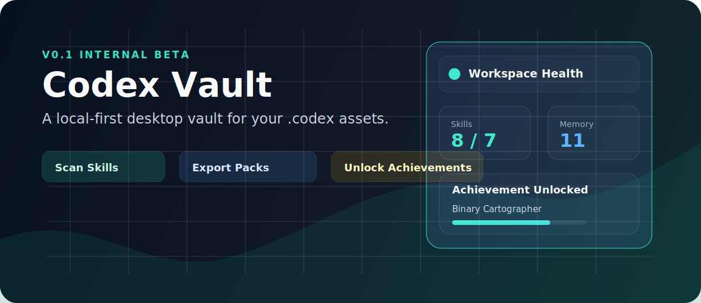
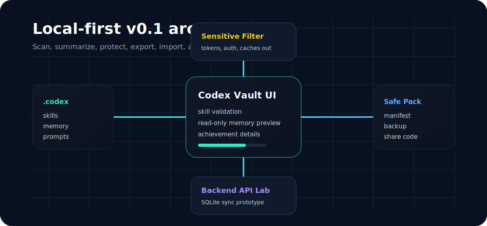

# Codex Vault

> v0.1 internal beta: a Windows desktop vault for inspecting, backing up, exporting, importing, and sharing your local Codex workspace assets.



Codex Vault is a lightweight desktop companion for people who keep valuable Codex configuration, skills, memory notes, project prompts, and migration packs under a local `.codex` directory.

The first beta focuses on a practical local workflow: see what matters, validate skills, preview memory, export a safe migration pack, import a shared pack, and celebrate progress with a playful achievement wall.

## Why

Codex users often accumulate useful local assets over time:

- personal and project-level skills
- memory and context notes
- global prompts and templates
- repeatable rules, snippets, and workflows
- local export packs for moving to a new machine or account

Those assets are easy to lose, hard to audit, and awkward to transfer manually. Codex Vault turns that folder into a visible, testable, shareable desktop experience.

## v0.1 Highlights

- **Windows desktop app** built with the Python standard library and `tkinter`.
- **Dark, high-density dashboard** inspired by developer tools and game platform libraries.
- **Skill overview** with count, validity checks, and `SKILL.md` preview.
- **Memory overview** with read-only markdown preview for safer beta testing.
- **Safe backup/export/import** with path traversal checks and pre-import backups.
- **Local share codes** for importing/exporting packs on the same machine.
- **Backend API lab** with SQLite-backed register, login, device, pack upload, share-code metadata, and download endpoints.
- **Interactive achievement wall** with 25 achievement cards, detail popups, requirements, and progress bars.
- **Achievement notifications** with Windows toast attempt and Tkinter fallback.
- **Low-permission design**: no admin rights, no npm, no Rust, no Electron, no cloud account required for the beta.



## What v0.1 Is Not Yet

Codex Vault v0.1 is intentionally conservative.

- It is **not** a hosted cloud service yet.
- It does **not** publish public share codes to the internet.
- It does **not** edit memory markdown from the UI in this beta.
- It does **not** ship as a full single-file PyInstaller build yet.
- It does **not** replace Tauri/Electron app shells yet.

The current `CodexVault.exe` is a small Windows launcher for the local batch script. It still expects Python to be available on the machine.

## Quick Start

Clone the repository:

```powershell
git clone https://github.com/DurianLoop/CodexVault.git
cd CodexVault
```

Run the desktop app:

```powershell
python -m codexvault.ui_app
```

Or double-click:

```text
run_codex_vault.bat
```

Start the local backend API lab:

```powershell
python -m codexvault.backend
```

Or double-click:

```text
run_backend.bat
```

## Default Data Location

On Windows, Codex Vault scans:

```text
C:\Users\<you>\.codex
```

You can point the app to another `.codex`-style folder from the UI.

## Safety Model

Codex Vault exports only a safe subset of your local Codex assets.

The exporter excludes common sensitive or noisy files such as:

- `auth.json`
- `cap_sid`
- `installation_id`
- `.env`
- token-like, API key-like, password-like, and private-key-like files
- cache folders
- session logs
- SQLite runtime files
- generated backups and exports

Imports are also guarded:

- import packs must include a manifest
- absolute paths are rejected
- `..` path traversal is rejected
- a local backup is created before writing imported files

Still, v0.1 is an internal beta. Review a pack before sharing it with someone else.

## Backend API Lab

The backend is deliberately small and easy to inspect. It uses Python's standard library HTTP server plus SQLite.

Available API areas:

- health check
- register
- login
- device binding
- pack upload
- share-code metadata
- pack download

This is a stepping stone toward real account sync in v0.2, not a production cloud service.

## Testing

Run the test suite:

```powershell
python -B -m unittest discover -s tests -v
```

Useful smoke checks:

```powershell
python -B -c "from codexvault.ui_app import CodexVaultApp, default_codex_path; print('UI_IMPORT_OK', default_codex_path())"
python -B -c "import ast, pathlib; files=list(pathlib.Path('codexvault').glob('*.py'))+list(pathlib.Path('tests').glob('*.py'))+list(pathlib.Path('tools').glob('*.py')); [ast.parse(p.read_text(encoding='utf-8'), filename=str(p)) for p in files]; print('AST_OK', len(files))"
```

## Repository Layout

```text
codexvault/                 App, scanner, workflow, backend, achievements
tests/                      Unit and workflow tests
tools/                      Build helpers
docs/                       Checklists, planning docs, roadmap docs
run_codex_vault.bat         Desktop launcher
run_backend.bat             Local backend launcher
build_portable_exe.bat      Lightweight launcher build helper
```

## v0.1 Beta Scope

This repository is published as a v0.1 internal beta for feedback on:

- local `.codex` scan model
- safe export/import behavior
- skill and memory summaries
- local share-code flow
- achievement interaction style
- backend API shape for future sync

The next target is v0.2, focused on a real sync model, stronger packaging, and a more polished achievement system.

See [docs/V0.2_UPGRADE_PLAN.md](docs/V0.2_UPGRADE_PLAN.md).

